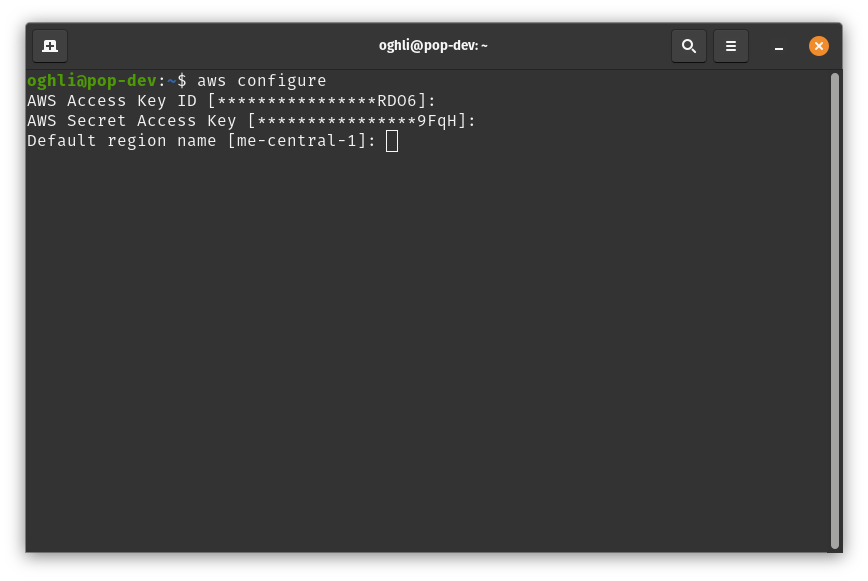

# AWS S3 Storage Data Package

This Python package developed to streamline the interaction with Amazon Simple Storage Service S3 offered by AWS.

It allows you to easily interact with data files on AWS S3 Storage using different operations such as Read, Write, Copy, Delete using boto3 API client integration with AWS.

The functionality that offered by this package version:

* Creating AWS S3 Storage object 
* Read File from AWS S3 Storage
* Write File to AWS S3 Storage
* Copy File from AWS S3 Storage
* Delete File from AWS S3 Storage
* Copy Directory from AWS S3 Storage
* Get File Permission
* Set File Permission
* Set Directory Permission

This python package can be used to build data ingesting pipline for any AWS cloud application, complete data engineering pipeline, Model training pipeline and cloud native data solutions.

## Installation Requirements 

You need AWS IAM user with access key credentials in order to use this package

You have 2 different methods to set up your AWS credentials

### Using AWS Shared Credentials

You need first to install [AWS CLI](https://docs.aws.amazon.com/cli/latest/userguide/getting-started-install.html) in your OS to set up your AWS shared credentials

After installing AWS CLI for your OS open your terminal or command line and run the command:

`aws configure`


You will prompt to enter your AWS IAM user `AWS Access Key ID` and `AWS Secret Access Key`




Shared credentials located by default in this file in your system `~/.aws/credentials`

### Using Environment Variables

In this method you don't need to install **AWS CLI**, but it's preferred to install it in your OS in case you need to check your aws services from you local machine

You can set AWS credentials as environment variables in your OS 

* On Linux and MacOS open your terminal and run the following commands

    ``` 
    export AWS_ACCESS_KEY_ID=your_access_key
    export AWS_SECRET_ACCESS_KEY=your_secret_key
   ```

* On Windows open your command line and run the following commands
    ``` 
    set AWS_ACCESS_KEY_ID=your_access_key
    set AWS_SECRET_ACCESS_KEY=your_secret_key
   ```
    
## How to Use it

* Copy `S3` module file into your project directory 
* Install python package dependency 
  * You can install the package either by adding it to your `requirement.txt` file:
     
    add `boto3==1.34.127` to it
    
    Then run `pip install -r requirements.txt`
  * Or you can install it by just running:
     
    `pip install boto3==1.34.127`

* Finally, you only need to import `StorageS3` class into your project source code:

  `from S3 import StorageS3`

## Documentation 

This [Tutorial Notebook](tutorial_notebook.ipynb) contains comprehensive guide documentation on how to use AWS S3 Storage Data Package

**Note:** `data_sample` directory contains all the data files used in AWS S3 tutorial notebook

## Developer and Contributor

**[Mohamad Oghli](https://github.com/mohammad-oghli)**